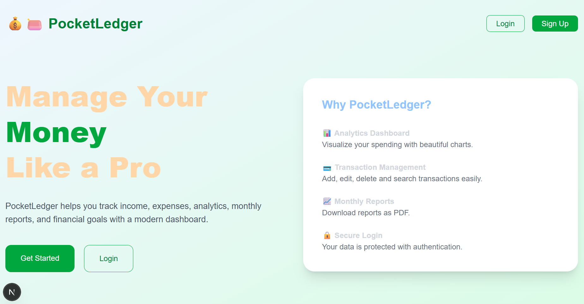
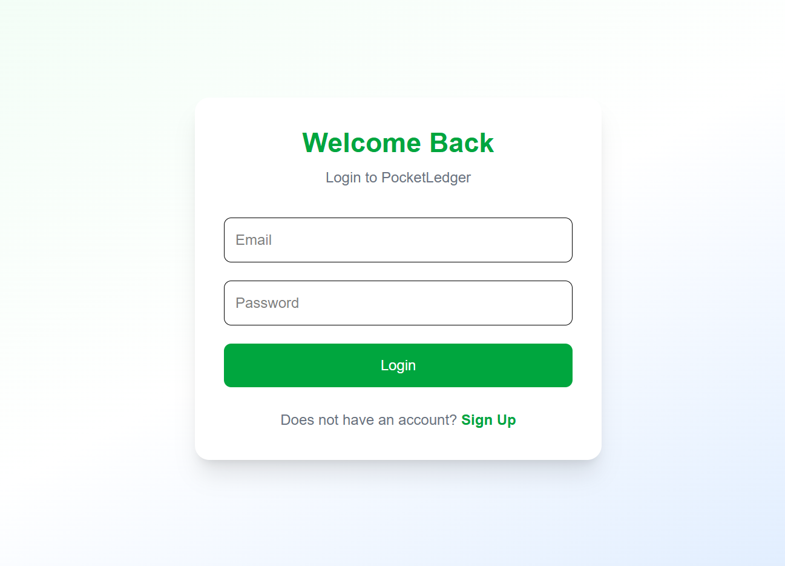
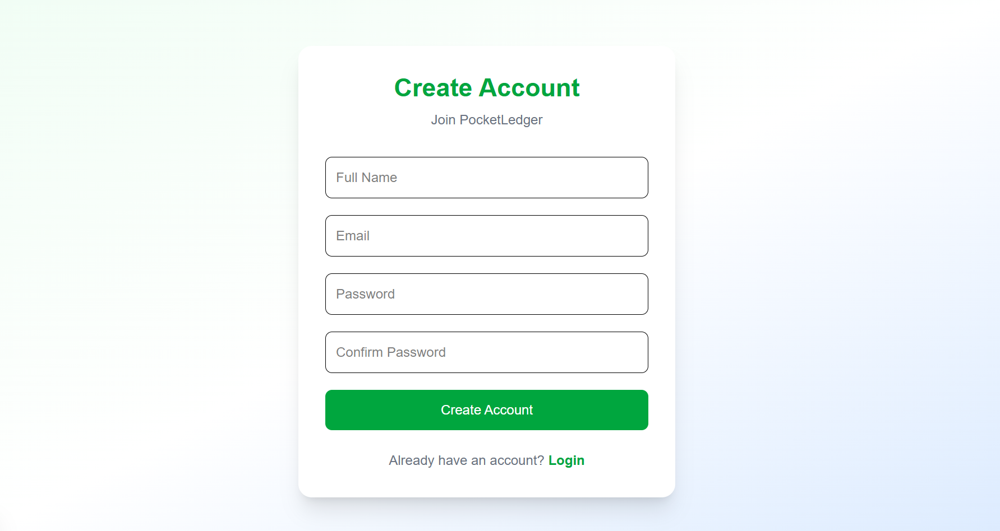
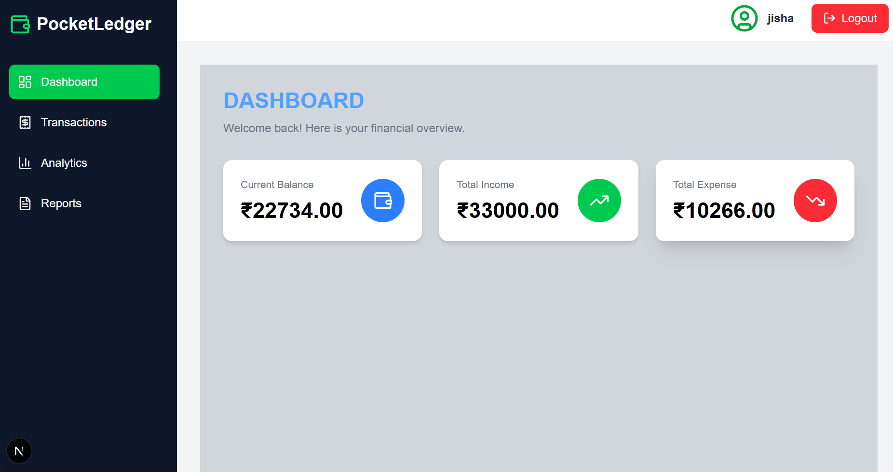
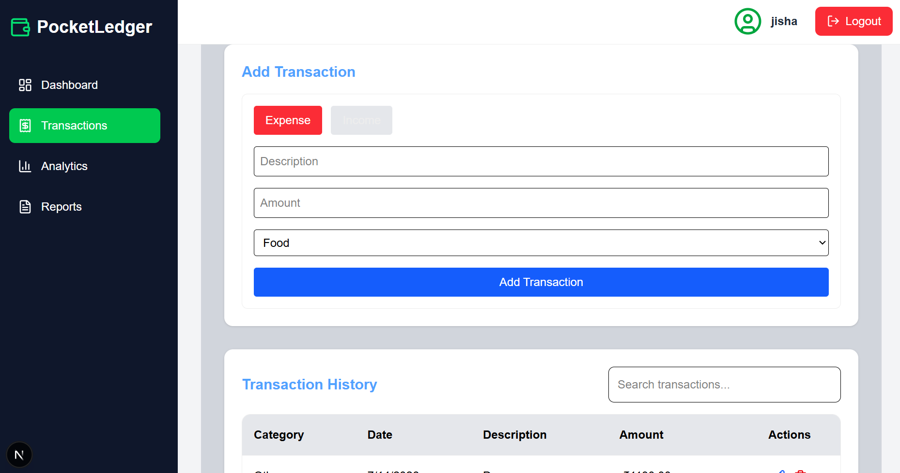
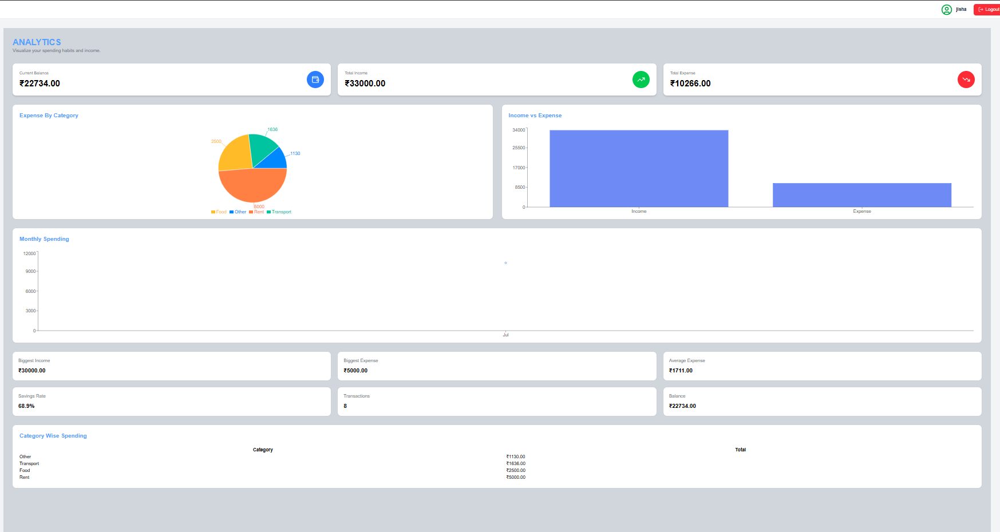
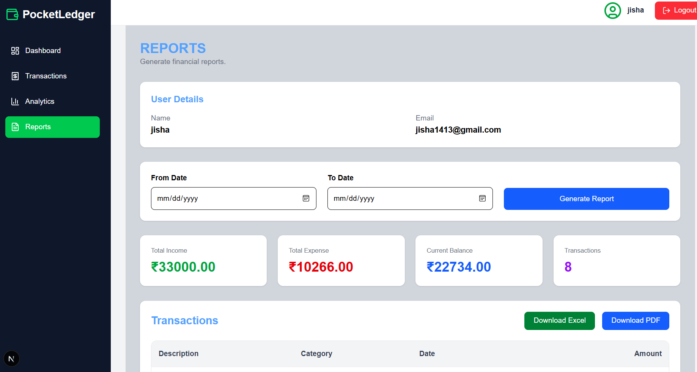

# 💰 PocketLedger

A modern Personal Finance Tracker built with **Next.js**, **TypeScript**, **Prisma ORM**, and **Neon PostgreSQL**.

PocketLedger allows authenticated users to securely manage their income and expenses, visualize analytics, generate reports, and monitor their financial health through an intuitive and fully responsive interface.

---

## 📖 Project Overview

PocketLedger is a full-stack web application that enables users to:

- Securely register and login
- Manage income and expenses
- View financial summaries
- Analyze spending habits
- Generate PDF & Excel reports
- Search and paginate transactions
- Maintain separate data for every authenticated user

---

# 🚀 Features

## 🔐 Authentication

- User Registration
- User Login
- JWT Authentication
- Protected Routes
- Secure HTTP Cookies
- Logout Functionality
- User-specific Dashboard

---

## 💵 Transaction Management

- Add Transactions
- Edit Transactions
- Delete Transactions
- Transaction History
- Search Transactions
- Server-side Pagination
- Continuous Serial Number across pages

---

## 📊 Dashboard

- Current Balance
- Total Income
- Total Expense
- Real-time Financial Summary

---

## 📈 Analytics

Visual representations of user finances including:

- Expense Distribution
- Monthly Expense Chart
- Income vs Expense Comparison
- Biggest Income
- Biggest Expense
- Average Expense
- Savings Rate
- Category-wise Expense Analysis

---

## 📄 Reports

Generate downloadable reports within a selected date range.

Supported formats:

- PDF Report
- Excel Report

Report contains:

- User Details
- Income
- Expense
- Balance
- Transaction History

---

## 📱 Responsive Design

- Mobile-friendly interface
- Tablet support
- Desktop optimized layout
- Responsive Sidebar with Hamburger Menu
- Responsive Charts
- Responsive Tables with Horizontal Scroll

---

# 🛠 Tech Stack

### Frontend

- Next.js 16
- React
- TypeScript
- Tailwind CSS

### Backend


- Next.js Route Handlers
- Prisma ORM
- Neon PostgreSQL

### Authentication

- JWT (JSON Web Token)
- HTTP-only Cookies

### Charts & Reports

- Recharts
- jsPDF
- jspdf-autotable
- SheetJS (xlsx)
- file-saver

---


# ⚙ Prerequisites

Install the following before running the project:

- Node.js (v18 or later)
- Neon Account (Free)
- Git
- npm

---

# 📥 Installation

## 1 Clone Repository

```bash
git clone https://github.com/jishashaji1413-hub/PocketLedger.git
```

---

## 2 Navigate into project

```bash
cd PocketLedger
```

---

## 3 Install Dependencies

# Install project dependencies
npm install


---

# 🔐 Environment Variables

Create a file named

```
.env
```

Add the following:

```env
DATABASE_URL="your-neon-database-url"

JWT_SECRET="your-secret-key"
```
Create a free database at

https://neon.tech
```
Generate your own JWT Secret using:

```bash
node -e "console.log(require('crypto').randomBytes(64).toString('hex'))"
```

---

# 🗄 Database Setup

Generate Prisma Client

```bash
npx prisma generate
```

Run Migrations

```
Create a PostgreSQL database on Neon and copy the connection string into the .env file.

```

Open Prisma Studio

```bash
npx prisma studio
```

---

# ▶ Running the Application

Start development server

```bash
npm run dev
```

Application will run at

```
http://localhost:3000
```

---

# 🔑 Authentication Flow

```
User Registers
       │
       ▼
Password Hashed using bcrypt
       │
       ▼
Saved in PostgreSQL
       │
       ▼
User Logs In
       │
       ▼
JWT Token Generated
       │
       ▼
Stored in HTTP-only Cookie
       │
       ▼
Protected Routes Verified
```

---

# 📌 API Endpoints

## Authentication

| Method | Endpoint | Description |
|---------|----------|-------------|
| POST | /api/register | Register User |
| POST | /api/login | Login |
| GET | /api/user | Get Logged-in User |

---

## Transactions

| Method | Endpoint | Description |
|---------|----------|-------------|
| GET | /api/transactions | Get Transactions |
| POST | /api/transactions | Add Transaction |
| PUT | /api/transactions | Update Transaction |
| DELETE | /api/transactions | Delete Transaction |

Supports:

- Pagination
- Search
- User-specific filtering

---

# 🔍 Search

Server-side searching is implemented.

Users can search by:

- Description
- Category

Search works seamlessly with pagination.

---

# 📑 Pagination

Server-side pagination is implemented.

Features:

- 5 records per page
- Previous / Next navigation
- Search compatible
- Continuous serial numbering


---

# 📊 Reports

Users can generate reports by selecting:

- From Date
- To Date

Available formats:

- PDF
- Excel

Each report includes:

- User Information
- Income
- Expense
- Balance
- Transactions

---

# 📈 Analytics

Analytics page provides:

- Income
- Expense
- Balance
- Savings Rate
- Monthly Expenses
- Expense Categories
- Biggest Income
- Biggest Expense
- Average Expense

---

# 🔒 Security Features

- JWT Authentication
- HTTP-only Cookies
- Password Hashing using bcrypt
- Prisma ORM (SQL Injection Protection)
- Protected API Routes
- User-specific Data Isolation

---

## 📸 Screenshots

### Home Page



---
### Login Page



---

### SignUp Page



---

### Dashboard



---

### Transactions



---

### Analytics



---

### Reports


---

# 🚀 Future Enhancements

Planned improvements include:

- Dark Mode
- Budget Planning
- Savings Goals
- Email Verification
- Forgot Password
- Password Reset
- Profile Management
- Multi Currency Support
- Notifications
- Data Backup

---


# 👩‍💻 Author

**Jisha Shaji**

GitHub:
https://github.com/jishashaji1413-hub


---

## 🚀 Deployment

This project is deployed using **Vercel**.

# 🌐 Live Demo

https://pocket-ledger-flax.vercel.app

The production database is hosted on **Neon PostgreSQL**.

---

# 📜 License

This project is created for educational and portfolio purposes.
